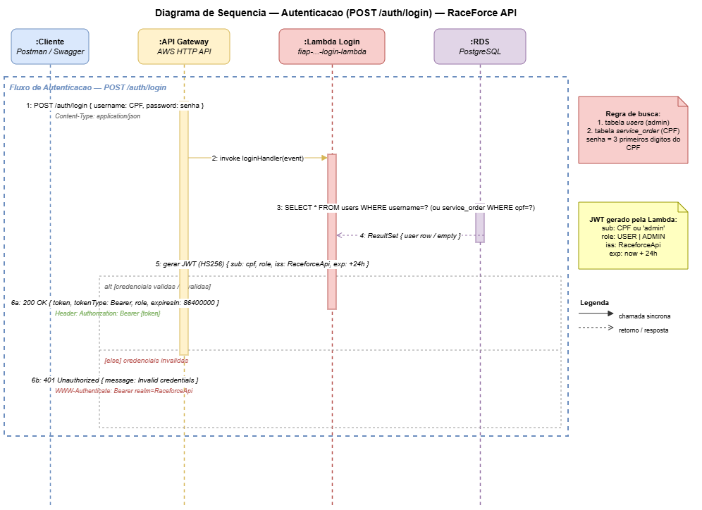

# fiap-14soat-tc-fase5-auth-lambda


[](https://github.com/jonasfschuh/fiap-14soat-tc-fase5-auth-lambda/actions/workflows/deploy.yaml)

---

## 📑 Sumário

- [👤 Autor](#-autor)
- [📋 Descrição](#-descrição)
- [🏗️ Arquitetura](#️-arquitetura)
- [🛠️ Tecnologias Utilizadas](#️-tecnologias-utilizadas)
- [⚙️ Variáveis de Configuração](#️-variáveis-de-configuração)
- [🔒 Proteção da Branch main](#-proteção-da-branch-main)
- [🚀 Execução e Deploy](#-execução-e-deploy)
- [🔒 Observações de Segurança](#-observações-de-segurança)
- [📈 Observabilidade](#-observabilidade)
- [🔗 Repositórios Relacionados](#-repositórios-relacionados)
- [🎬 Vídeos de Apresentação](#-vídeos-de-apresentação)
- [📖 Documentação Técnica](#-documentação-técnica)
- [🔗 Repositórios Relacionados](#-repositórios-relacionados)

---

## 👤 Autor

| Nome                 | E-mail                  | RM        | Discord          | WhatsApp        |
|----------------------|-------------------------|-----------|------------------|-----------------|
| Jonas Fernando Schuh | jonasschuh@hotmail.com  | rm369458  | jonasf.schuh     | 47 9 9960-1396  |

**Grupo:** 2 — RaceForce · FIAP 14SOAT Fase 5

---

## 📋 Descrição

Este repositório implementa a **camada de autenticação serverless** da plataforma RaceForce, utilizando **AWS Lambda** (Java 21) integrado ao **AWS API Gateway HTTP API v2**.

Contém duas funções Lambda distintas e toda a infraestrutura associada provisionada via **Terraform**:

| Função | Handler | Responsabilidade |
|--------|---------|------------------|
| **LoginHandler** | `br.com.fiap.authlambda.handler.LoginHandler::handleRequest` | Autentica usuário por CPF/senha no PostgreSQL e emite token **JWT HS256** |
| **JwtAuthorizerHandler** | `br.com.fiap.authlambda.handler.JwtAuthorizerHandler::handleRequest` | Valida o JWT Bearer em todas as rotas protegidas do API Gateway |

### Regras de Autenticação

1. Busca o usuário na tabela `users` (administradores e operadores);
2. Se não encontrado, busca na tabela `service_order` pelo **CPF do cliente**;
3. Senha padrão para clientes = **primeiros 3 dígitos do CPF**;
4. Retorna role `ADMIN` para usuários administrativos ou `USER` para demais.

### Rotas do API Gateway

| Grupo | Rotas | Autenticação |
|-------|-------|--------------|
| Públicas | `POST /auth/login`, `GET /healthz` | Nenhuma |
| Protegidas | `/customer`, `/vehicle`, `/service`, `/product`, `GET /service-order` | **JWT Bearer obrigatório** |
| Catch-all | `ANY /{proxy+}` | Nenhuma (fallback para EKS) |

> ℹ️ Este repositório **não** inclui a aplicação Spring Boot, o banco de dados nem a infraestrutura Kubernetes — cada um possui seu próprio repositório (ver seção [Repositórios Relacionados](#-repositórios-relacionados)).

---

## 🏗️ Arquitetura

### Diagrama de Componentes


### Diagrama de Sequência — Fluxo de Autenticação



### Fluxo de Login

```
Cliente
  │
  ▼  POST /auth/login  {cpf, senha}
API Gateway (público)
  │
  ▼
Lambda: LoginHandler
  │  SELECT users / service_order (RDS PostgreSQL)
  │  validação BCrypt
  ▼
JWT HS256  {sub, role, email, iss, iat, exp}
  │
  ▼
{ token, role, expiresIn, username }  →  Cliente
```

### Fluxo de Autorização de Rotas Protegidas

```
Cliente
  │
  ▼  GET /service-order   Authorization: Bearer <token>
API Gateway
  │
  ▼
Lambda: JwtAuthorizerHandler
  │  valida assinatura HS256 + claims (iss, exp, role)
  ├── token válido   →  encaminha para EKS (VPC Link → NLB → Pod)
  └── token inválido →  401 Unauthorized
```

### Outputs publicados no State Remoto

| Output | Descrição |
|--------|-----------|
| `login_lambda_arn` | ARN da função Lambda de Login |
| `login_lambda_name` | Nome da função de Login |
| `authorizer_lambda_arn` | ARN da função Lambda Authorizer |
| `authorizer_lambda_name` | Nome da função Authorizer |
| `api_gateway_id` | ID do API Gateway |
| `api_gateway_endpoint` | Endpoint público do API Gateway |
| `api_gateway_execution_arn` | ARN de execução do API Gateway |
| `vpc_link_id` | ID do VPC Link (Gateway → NLB → EKS) |
| `api_gateway_log_group_name` | Nome do CloudWatch Log Group |

---

## 🛠️ Tecnologias Utilizadas

| Tecnologia | Versão / Uso |
|------------|--------------|
| **Java 21** | Runtime da AWS Lambda (LTS com suporte a SnapStart) |
| **Maven 3.9+** | Build e empacotamento do projeto (`maven-shade-plugin`) |
| **AWS Lambda** | Funções serverless: `LoginHandler` e `JwtAuthorizerHandler` |
| **AWS API Gateway HTTP API v2** | Roteamento público + integração VPC Link com EKS |
| **JWT (HS256)** | Tokens de autenticação — issuer `RaceforceApi`, expiração 24h |
| **BCrypt** | Hash de senhas armazenadas no PostgreSQL |
| **Amazon RDS PostgreSQL** | Fonte de dados para autenticação (tabelas `users` / `service_order`) |
| **AWS SAM CLI** | Build e deploy local das Lambdas |
| **Terraform** | Provisionamento de Lambdas, API Gateway, VPC Link e CloudWatch |
| **Amazon S3** | Backend remoto do Terraform state (`lambda-auth/terraform.tfstate`) |
| **New Relic** | Observabilidade: logs estruturados JSON + métricas customizadas |
| **GitHub Actions** | Pipeline CI/CD de build, deploy e destroy automatizados |

---

## ⚙️ Variáveis de Configuração

### Variáveis de Ambiente da Lambda

| Variável | Descrição | Exemplo |
|----------|-----------|---------|
| `JWT_SECRET` | Chave secreta HS256 (mínimo 32 chars) | `minha-chave-secreta-...` |
| `JWT_ISSUER` | Emissor do token JWT | `RaceforceApi` |
| `JWT_EXPIRATION_MS` | Expiração do token em ms | `86400000` (24h) |
| `DB_URL` | JDBC URL do PostgreSQL | `jdbc:postgresql://host:5432/raceforce_db` |
| `DB_USER` | Usuário do banco | `postgres` |
| `DB_PASSWORD` | Senha do banco | *(via Secrets Manager)* |
| `DB_POOL_SIZE` | Tamanho do pool de conexões | `3` |

### Terraform — `terraform/terraform.tfvars`

```hcl
# terraform/terraform.tfvars

aws_region         = "us-east-1"
project_identifier = "fiap-14soat-fase5-raceforce"

# Remote states (infra e banco)
infra_terraform_state_bucket = "fiap-14soat-fase5-jonasfschuh"
banco_terraform_state_bucket = "fiap-14soat-fase5-jonasfschuh"

# Lambda
lambda_runtime     = "java21"
lambda_timeout     = 30
lambda_memory_size = 512
lambda_enable_vpc  = true

# JWT
jwt_issuer        = "RaceforceApi"
jwt_expiration_ms = 86400000

# Segredos — nunca commitar!
# jwt_key       = via TF_VAR_jwt_key
# db_password   = via TF_VAR_db_password
# new_relic_account_id  = via TF_VAR_new_relic_account_id
# new_relic_license_key = via TF_VAR_new_relic_license_key
```

### Secrets e Variáveis para CI/CD (GitHub Actions)

| Secret / Variable | Descrição |
|-------------------|-----------|
| `AWS_ACCESS_KEY_ID` | Credencial AWS Academy |
| `AWS_SECRET_ACCESS_KEY` | Credencial AWS Academy |
| `AWS_SESSION_TOKEN` | Token de sessão AWS Academy |
| `TF_VAR_JWT_KEY` | Chave secreta do JWT |
| `TF_VAR_DB_PASSWORD` | Senha do PostgreSQL |
| `NEW_RELIC_KEY` | Chave de licença New Relic (`TF_VAR_new_relic_license_key`) |
| `NEW_RELIC_ACCOUNT_ID` | Account ID New Relic |

---

## 🔒 Proteção da Branch main

As regras abaixo foram aplicadas em todos os 4 repositórios da stack para atender ao requisito do Tech Challenge:

> *"Branch main protegida (sem commits diretos). Uso obrigatório de Pull Requests para merge. Deploy automático das branches de produção."*

### Regras configuradas no GitHub → Settings → Branches

| Regra | Valor                                                                                                      |
|---|------------------------------------------------------------------------------------------------------------|
| **Require a pull request before merging** | ✅ Ativado — bloqueia commits diretos na `main`                                                             |
| **Required approvals** | `1` revisão obrigatória antes do merge (OBS: no caso desse estudo desabilitado que tem 1 pessoa no grupo)  |
| **Dismiss stale reviews on new commits** | ✅ Ativado — revalida aprovação se o PR for atualizado                                                      |
| **Require status checks to pass** | ✅ Ativado — bloqueia merge se o PR Validation falhar                                                       |
| **Require branches to be up to date** | ✅ Ativado — evita merge de branch desatualizada                                                            |
| **Do not allow bypassing** | ✅ Ativado — nem o owner ignora as regras                                                                   |

### Status checks obrigatórios neste repositório

| Check | Job no `pr-validation.yaml` |
|---|---|
| `build-and-test` | Build Maven + testes unitários da Lambda |
| `terraform-validation` | Valida `terraform init` e `validate` na pasta `terraform/` |

> ⚠️ O status check só aparece para seleção no GitHub após a **primeira execução bem-sucedida** do PR Validation.

---

## 🕹️ Deploy Manual — Decisão de Projeto (AWS Academy)

> *"Por que o deploy não é acionado automaticamente a cada `push` para `main`?"*

Os workflows de deploy desta stack utilizam `workflow_dispatch` (disparo manual) de forma **intencional e justificada**. Essa decisão foi tomada em razão da **natureza efêmera do ambiente AWS Academy**:

- Cada sessão do AWS Academy possui um limite de **4 horas** de execução ativa;
- As credenciais (`AWS_ACCESS_KEY_ID`, `AWS_SECRET_ACCESS_KEY`, `AWS_SESSION_TOKEN`) expiram ao fim de cada sessão e precisam ser renovadas manualmente;
- Um trigger automático a cada `push` para `main` **recriaria toda a infraestrutura a cada commit**, consumindo rapidamente o budget de horas disponível e gerando custos desnecessários com recursos provisionados fora do período de uso;
- A recriação automática de recursos como **Lambda Functions, API Gateway e VPC Link** dentro do ciclo de 4 horas tornaria inviável o uso contínuo da plataforma para demonstração e validação acadêmica.

**O deploy é iniciado manualmente pelo autor** via *GitHub Actions → Run workflow*, garantindo controle total sobre quando os recursos são provisionados e consumindo o budget de forma consciente e responsável.

> 💡 **Endpoint de produção:** O endpoint do API Gateway é gerado dinamicamente pelo Terraform a cada deploy e **não possui um valor fixo** — o AWS Academy recria os recursos a cada nova sessão. O endpoint ativo é exibido automaticamente no **GitHub Actions Summary** após cada execução bem-sucedida do workflow de deploy.

---

## 🚀 Execução e Deploy

### Pré-requisitos

- [Java 21](https://adoptium.net/)
- [Maven 3.9+](https://maven.apache.org/)
- [AWS SAM CLI](https://docs.aws.amazon.com/serverless-application-model/latest/developerguide/install-sam-cli.html)
- [Terraform](https://developer.hashicorp.com/terraform/downloads) >= 1.3
- [AWS CLI](https://aws.amazon.com/cli/) configurado (`aws configure`)
- RDS PostgreSQL provisionado (repositório `iac-database`) e acessível

---

### Opção A — Deploy via Terraform (CI/CD recomendado)

#### 1. Build do JAR

```bash
cd src/auth-lambda
mvn clean package -DskipTests
```

#### 2. Inicializar o Terraform

```bash
cd ../../terraform
terraform init
```

#### 3. Planejar e aplicar

```bash
terraform plan -out tfplan
terraform apply tfplan
```

#### 4. Obter o endpoint do API Gateway

```bash
terraform output api_gateway_endpoint
```

#### 5. Destruir (economia de budget no AWS Academy)

```bash
terraform destroy
```

---

### Opção B — Deploy via AWS SAM (desenvolvimento local)

#### 1. Build e validação

```bash
cd src/auth-lambda
mvn clean package
sam validate --template-file template.yaml
sam build --template-file template.yaml
```

#### 2. Deploy guiado

```bash
sam deploy --guided --template-file template.yaml
```

---

### Testes Unitários

```bash
cd src/auth-lambda
mvn clean test
```

---

### Ordem de Deploy da Stack Completa

| # | Repositório                                 | Descrição |
|---|---------------------------------------------|-----------|
| 1 | fiap-14soat-tc-fase5-iac-terraform          | VPC, EKS, NLB, S3, IAM |
| 2 | fiap-14soat-tc-fase5-iac-database           | RDS PostgreSQL |
| 3 | **fiap-14soat-tc-fase5-auth-lambda** ← este | Lambda Login + Authorizer + API Gateway |
| 4 | fiap-14soat-tc-fase5-app-k8s               | Aplicação + manifests K8s |

---

## 🔒 Observações de Segurança

- **Nunca** comite `JWT_SECRET`, `DB_PASSWORD` ou `jwt_key` em texto puro no repositório;
- Em produção, injete segredos via **AWS Secrets Manager** ou **SSM Parameter Store**;
- Com `lambda_enable_vpc = true`, as Lambdas executam dentro da VPC com acesso restrito ao RDS;
- O catch-all `ANY /{proxy+}` não possui autenticação — rotas sensíveis devem ser explicitamente adicionadas às rotas protegidas.

> 💡 **Acesso acadêmico (AWS Academy):** o ambiente pode conter o usuário de teste `admin / admin123` exclusivamente para validação do Tech Challenge. **Remova em produção.**

---

## 📈 Observabilidade

Logs estruturados JSON no CloudWatch e New Relic em cada requisição de autenticação:

| Campo | Descrição |
|-------|-----------|
| `cpf` | CPF do usuário autenticado (mascarado) |
| `authResult` | `SUCCESS` ou `FAILURE` |
| `reason` | Motivo da falha (quando aplicável) |
| `latencyMs` | Latência da operação |
| `correlationId` | Header `X-Correlation-Id` ou `awsRequestId` |

**Métricas customizadas** no namespace `Raceforce/Auth`:

| Métrica | Descrição |
|---------|-----------|
| `auth_login_success_total` | Total de logins bem-sucedidos |
| `auth_login_failure_total` | Total de logins falhos (com dimensão `reason`) |
| `auth_token_issued_total` | Total de tokens JWT emitidos |

---

## 🔗 Repositórios Relacionados

| Repositório                                                                                              | Descrição |
|----------------------------------------------------------------------------------------------------------|-----------|
| [fiap-14soat-tc-fase5-iac-terraform](https://github.com/jonasfschuh/fiap-14soat-tc-fase5-iac-terraform) | VPC, EKS, NLB — infraestrutura base |
| [fiap-14soat-tc-fase5-iac-database](https://github.com/jonasfschuh/fiap-14soat-tc-fase5-iac-database)    | RDS PostgreSQL |
| [fiap-14soat-tc-fase5-auth-lambda](https://github.com/jonasfschuh/fiap-14soat-tc-fase5-auth-lambda)      | **Este repositório** — Lambda Auth + API Gateway |
| [fiap-14soat-tc-fase5-app-k8s](https://github.com/jonasfschuh/fiap-14soat-tc-fase5-app-k8s)              | Aplicação Spring Boot + manifests K8s |

---

## 📖 Documentação Técnica

| Tipo | Arquivo | Descrição |
|------|---------|-----------|
| 📋 RFC | [RFC-001 — Autenticação Serverless com AWS Lambda e JWT](docs/RFC%20-%20Requests%20for%20Comments/RFC-001-autenticacao-serverless.md) | Justificativa técnica da estratégia de autenticação |
| 🏛️ ADR | [ADR-001 — Lambda Authorizer para Proteção de Rotas](docs/ADR%20-%20Architecture%20Decision%20Records/ADR-001-lambda-authorizer.md) | Decisão arquitetural: Lambda Authorizer no API Gateway |
| 🖼️ Diagrama Componentes | [Components-repo-auth-lambda.drawio.png](docs/diagrams/Components-repo-auth-lambda.png) | O que este repositório provisiona na AWS |
| 🔄 Diagrama de Sequência | [Sequence-authentication-uml.drawio.png](docs/diagrams/Sequence-authentication-uml.drawio.png) | Fluxo de autenticação: Cliente → API GW → Lambda → RDS → JWT |

> ℹ️ **Swagger / OpenAPI:** este repositório expõe dois endpoints públicos documentados abaixo. A documentação completa da API REST da aplicação está no repositório [fiap-14soat-tc-fase5-app-k8s](https://github.com/jonasfschuh/fiap-14soat-tc-fase5-app-k8s).

### Endpoints da Lambda

#### `POST /auth/login`

```json
// Request
{
  "cpf": "12345678900",
  "senha": "123"
}

// Response 200
{
  "token": "eyJhbGciOiJIUzI1NiJ9...",
  "role": "USER",
  "expiresIn": 86400000,
  "username": "João Silva"
}

// Response 401
{
  "message": "Credenciais inválidas"
}
```

#### `GET /healthz`

```json
// Response 200
{
  "status": "UP"
}
```
---

### 🎬 Vídeos de Apresentação

| Fase | Link |
|------|------|
| Fase 1  | [Apresentação Tech Challenge 1 — RaceForce](https://youtu.be/EKwE8l4yE1M) |
| Fase 2  | [Apresentação Tech Challenge 2 — RaceForce](https://youtu.be/95ml0-H9Vf4) |
| Fase 3  | [Apresentação Tech Challenge 3 — RaceForce](https://www.youtube.com/watch?v=KB-FC_4zsPE) |
| Fase 4  | [Apresentação Tech Challenge 4 — RaceForce](https://www.youtube.com/watch?v=vR3x4kW0l90) |
| Fase 5  | *(em breve)* |

---

## 🔗 Repositórios Relacionados


| Ordem | Repositório                                                                                               | Descrição                                |
|-------|-----------------------------------------------------------------------------------------------------------|------------------------------------------|
| 1     | [fiap-14soat-tc-fase5-iac-terraform](https://github.com/jonasfschuh/fiap-14soat-tc-fase5-iac-terraform)   | VPC, EKS, NLB, SQS — infraestrutura base |
| 2     | [fiap-14soat-tc-fase5-auth-lambda](https://github.com/jonasfschuh/fiap-14soat-tc-fase5-auth-lambda)       | Lambda Login + Authorizer + API Gateway  |
| 3     | [fiap-14soat-tc-fase5-customer](https://github.com/jonasfschuh/fiap-14soat-tc-fase5-customer)             | Microserviço Customer                    |
| 4     | [fiap-14soat-tc-fase5-vehicle](https://github.com/jonasfschuh/fiap-14soat-tc-fase5-vehicle)               | Microserviço Vehicle                     |
| 5     | [fiap-14soat-tc-fase5-stocks](https://github.com/jonasfschuh/fiap-14soat-tc-fase5-stocks)                 | Microserviço Stocks                      |
| 6     | [fiap-14soat-tc-fase5-service](https://github.com/jonasfschuh/fiap-14soat-tc-fase5-service)               | Microserviço Service                     |
| 7     | [fiap-14soat-tc-fase5-purchase-order](https://github.com/jonasfschuh/fiap-14soat-tc-fase5-purchase-order) | Microserviço Purchase Order              |
| 8     | [fiap-14soat-tc-fase5-billing](https://github.com/jonasfschuh/fiap-14soat-tc-fase5-billing)               | Microserviço Billing                     |
| 9     | [fiap-14soat-tc-fase5-service-order](https://github.com/jonasfschuh/fiap-14soat-tc-fase5-service-order)   | Microserviço Service Order               |

---
